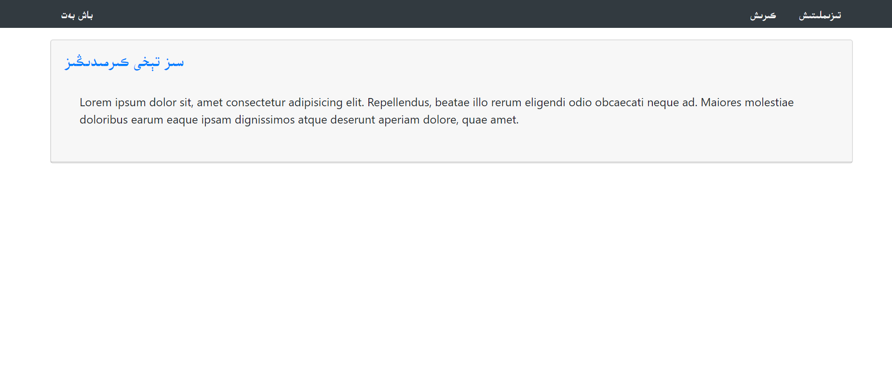
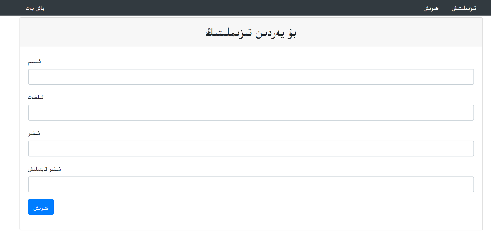
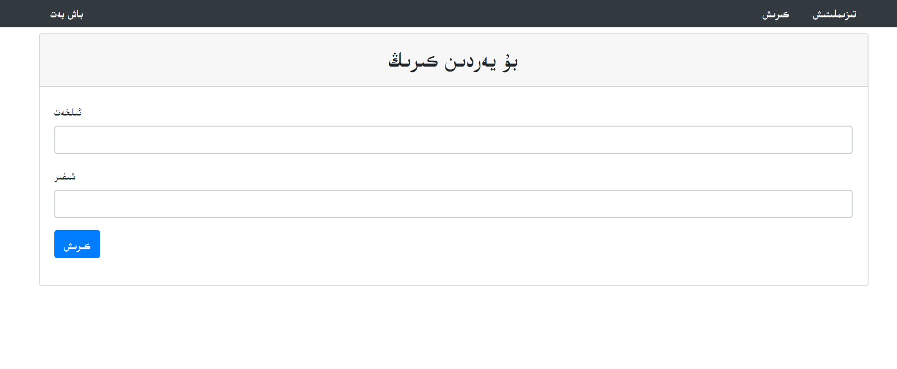
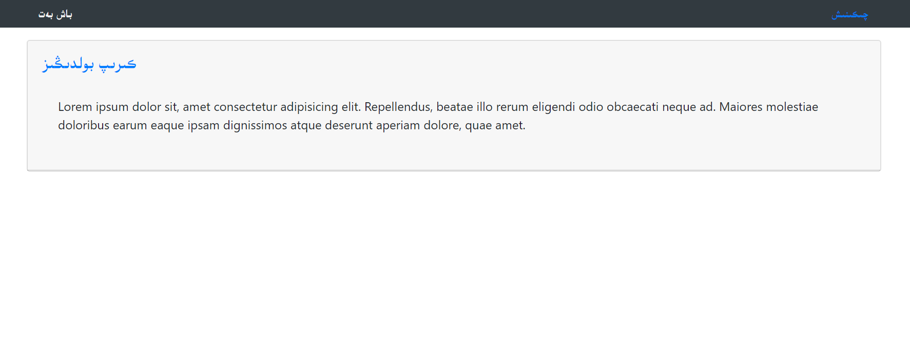

# login_system-best-one-
php最完整的登陆系统，加密解密都有

感觉是个很完整的登陆系统

```
* view部分直接在根目录
* 逻辑处理都在includes文件里
* sign,login的各种检查都写的很详细，在sign.inc.php,login.inc.php里
* 对密码加密检查也在里面
* 用了bootstrap
* 各个功能的界面在images文件夹里边
```

同样维文解决问题用unicode-orange,好处维文可以用自己设定的字体，英文中文都可以用其他的字体，定位100%准确

```css
@font-face {
    font-family: 'uyfont';
    src: local('UKIJ Esliye');
    unicode-range: 	U+0600-06FF;  //这是维文的unicode范围
  }
  
*{
    font-family: uyfont,'Segoe UI', Tahoma, Geneva, Verdana, sans-serif;
}
```

不登陆，首页:

注册页面

登陆页面

登陆成功



